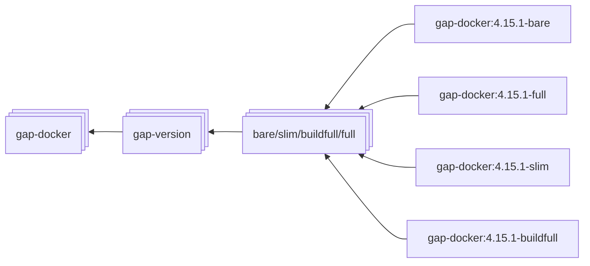

## gap-docker

[](https://github.com/gap-system/docker/actions/workflows/main.yaml)

## Image types


```mermaid
    graph RL
        V1[gap-docker:4.15.1-bare]      --> T
        V2[gap-docker:4.15.1-full]      --> T
        V3[gap-docker:4.15.1-slim]      --> T
        V4[gap-docker:4.15.1-buildfull] --> T
        T --> V
        V --> G
        
        G@{ shape: processes, label: "gap-docker"}
        V@{ shape: processes, label: "gap-version"}
        T@{ shape: processes, label: "bare/slim/buildfull/full"}
```

We have the following variants[^1]:

* **`bare`** - Core compiled from source with only the `PackageManager` package installed. Required packages are loaded via `InstallRequiredPackages()` — no optional packages are compiled. This is the _smallest image_, suitable for minimal or custom setups where you want full control over which packages to add.

* **`slim`** - Includes additional runtime libraries needed by optional packages. Suitable for users who want to _selectively compile_ only the packages they need. All deposited `GAP` packages (i.e. those distributed in the release archives) are included, but those requiring compilation _have not been_ compiled. Some system packages required to compile GAP packages are also installed in the container.

* **`full`** - Contains _all packages compiled_ via `BuildPackages.sh --parallel`. It is the largest image and the most comprehensive variant. Recommended for most users.

* **`jupyter-gap`** - A separate image based on the `full` variant. Adds `JupyterLab` and the `gap-kernel`. Exposes port `8888` and launches notebook as the default command.

Besides that we have:

* **`buildfull`** - An _internal build stage_ used to compile all packages for the `full` image. Referenced in the build pipeline but not intended for direct use.

---

## Usage

* Run a container:

```
docker run -it ghcr.io/gap-system/gap:4.15.1-full
```

```
docker run -it ghcr.io/gap-system/gap:4.15.0-full
```

```
docker run -it ghcr.io/gap-system/gap:4.14.0-bare
```

```
docker run -it ghcr.io/gap-system/gap:4.14.0-bare
```


## Authors
Although it was completely rewritten, this repository consists of various ideas from many repositories
* Kamil Zabielski -- [@limakzi](https://github.com/limakzi)
* James D. Mitchell [[1][1]] -- [@james-d-mitchell](https://github.com/james-d-mitchell)
* Sam Tetrooy [[2][2]] -- [@stertooystertooy](https://github.com/stertooy)

[1]: https://github.com/james-d-mitchell/gap-docker-minimal
[2]: https://github.com/stertooy/gda-image

[^1]: All variants are based on `Ubuntu 22.04` LTS.
