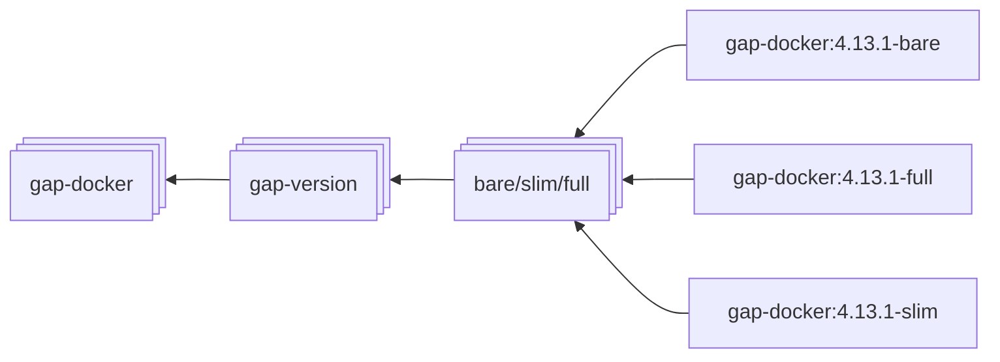

## gap-docker

[](https://github.com/limakzi/gap-docker/actions/workflows/main.yaml)

## Image types



* Run a container:

```
docker run -it ghcr.io/limakzi/gap-docker:4.13.1-full
```

```
docker run -it ghcr.io/limakzi/gap-docker:4.14.0-full
```

```
docker run -it ghcr.io/limakzi/gap-docker:4.13.1-bare
```

```
docker run -it ghcr.io/limakzi/gap-docker:4.14.0-bare
```


## Authors
Although it was completely rewritten, this repository consists of various ideas from many repositories
* Kamil Zabielski -- [@limakzi](https://github.com/limakzi)
* James D. Mitchell [[1](1)] -- [@james-d-mitchell](https://github.com/james-d-mitchell)
* Sam Tetrooy [[2](2)] -- [@stertooystertooy](https://github.com/stertooy)

[1]: https://github.com/james-d-mitchell/gap-docker-minimalhttps://github.com/james-d-mitchell/gap-docker-minimal
[2]: https://github.com/stertooy/gda-image/